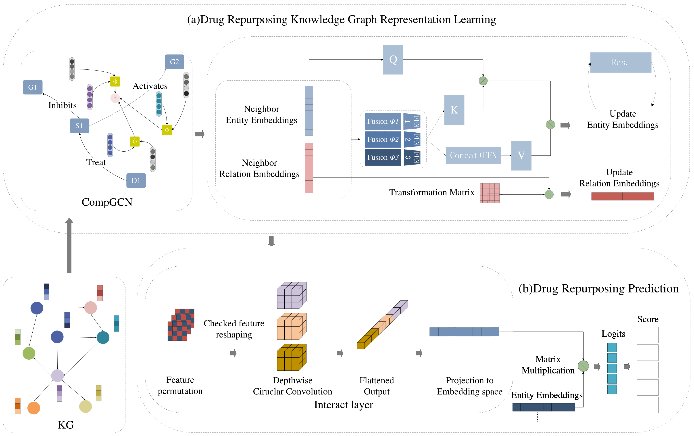

# MPTN

**This is the data and code for our paper** `MPTN: a message-passing transformer network for drug repurposing from knowledge graph`.

## Prerequisites

* `Python(version >= 3.6)`
* `pytorch(version>=1.4.0)`
*  `ordered_set(version>=3.1)`
* `pytorch>=1.7.1 & <=1.9`
* `numpy(version>=1.16.2)`
* `torch_scatter(version>=2.0.4)`
* `scikit_learn(version>=0.21.1)`
* `torch-geometric`

## Datastes

We provide the dataset in the [data](data/) folder.

| Data | 
| --- |
| [GP-KG](data/GP-KG/)|
| [OpenBioLink](data/openbiolink/) |
